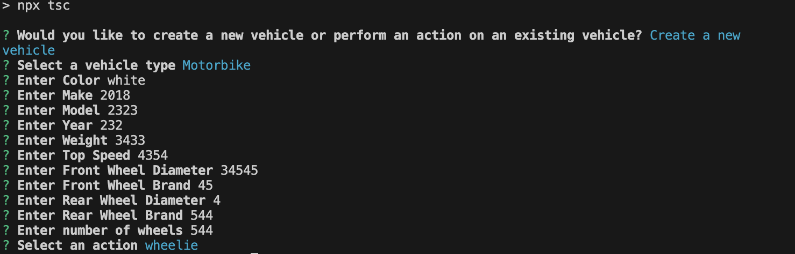

# ts-project

Vehicle Towing System

Description
This project implements a Vehicle Towing System using TypeScript and object-oriented programming principles. It supports the creation of various vehicle types (such as Trucks, Motorbikes, and Cars) and allows the user to select a vehicle that can tow other vehicles, adhering to their towing capacity. The system uses an interface (AbleToTow) to ensure that any vehicle capable of towing implements the required towing behavior.

Key Features:
Define vehicle classes: Truck, Motorbike, and Car
Implement an AbleToTow interface for vehicles that can tow other vehicles.
Use Inquirer.js to select vehicles and perform actions via the command line.
Implement logic to ensure a vehicle cannot tow itself and checks against towing capacity.

Table of Contents
Installation
Usage
Structure
Technologies

Installation
Clone the repository:
Install dependencies:npm i
Compile TypeScript :npx start 

Usage:
Running the Application
This will launch a command-line interface (CLI) where you can:

Create new vehicles (Truck, Motorbike, Car)
Select a vehicle to tow
Perform other vehicle-related actions

structure
├── src
│   ├── classes
│   │   ├── Truck.ts
│   │   ├── Car.ts
│   │   └── Motorbike.ts
│   ├── interfaces
│   │   └── AbleToTow.ts
│   ├── Cli.ts
│   └── index.ts
├── package.json
├── tsconfig.json
└── README.md

Technologies
TypeScript: Strongly typed programming language for writing JavaScript code.
Inquirer.js: A collection of common interactive command-line user interfaces.
Node.js: Runtime for executing the JavaScript/TypeScript code.

Screenshot for the command line

LINK TO GIT REPO

LINK TO THE WALK THROUGH VIDEO
